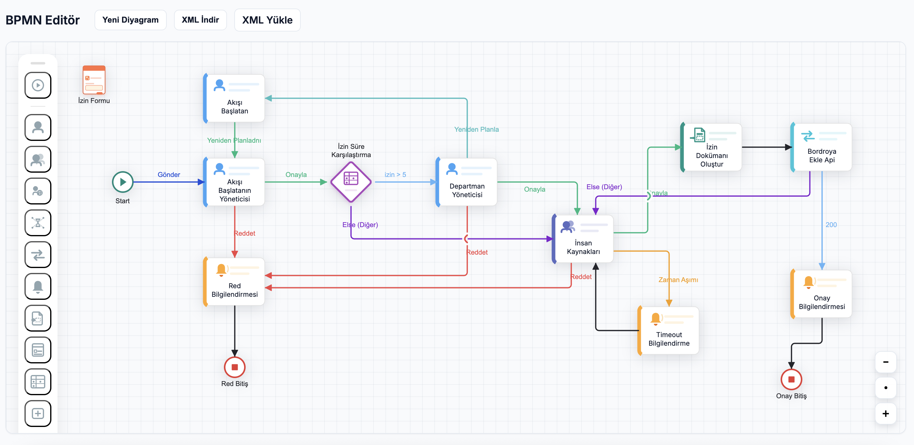
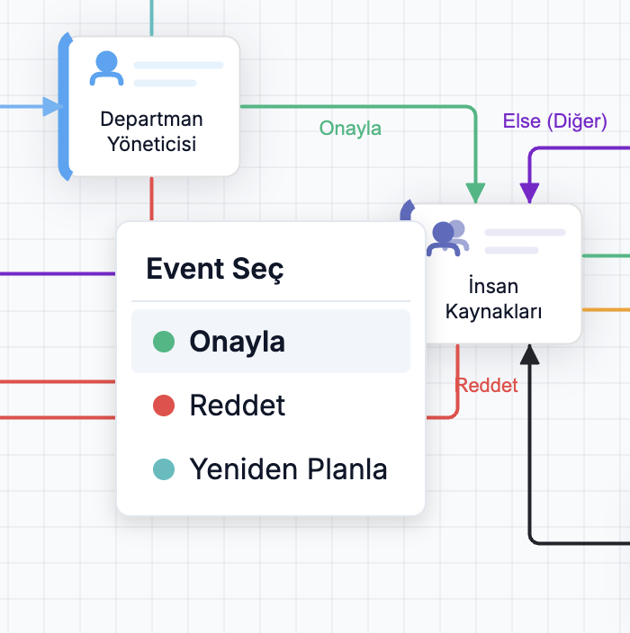

# BPMN Editör (Vue 3 + bpmn-js)

Örnek Vue 3 projesi; bpmn-js ile özel task paleti, kontekst menüsü ve event bağlantı mantığına sahip modern BPMN editörü.

## Kurulum

```bash
npm install
npm run dev
```

Uygulama varsayılan olarak `http://localhost:5173` adresinde çalışır.

## Özellikler

- Start, User Task, User Group Task, Service Task, Decision Node, Notification, API Call, End düğümleri için özel palet.
- Her öğe `data-task-type` alanı üzerinden renklenir ve tanımlı metadataları taşır.
- Başlangıç diyagramı hazır gelir, XML içe/dışa aktarma butonları mevcuttur.
- Modal üzerinden çift tıklayarak dokümandaki tüm `data-*` alanları düzenleyebilirsiniz; alanlar tip bazlı gösterilir.

## Ekran Görselleri

> Tüm görseller `assets/images` klasöründedir, aşağıda en kritik akışlar özetlendi.

| Önizleme | Açıklama |
| --- | --- |
|  | Ana kanvas, özel palet ve zoom kontrolleri |
|  | Her task için özelleştirilmiş context-pad aksiyonları |
|  | Çift tıklama ile açılan dinamik özellik modali |
|  | Bağlantı üzerindeki event değişim popup’ı |

## Notlar

- Bağımlılıkları indirmek için internet gerekir; çevrimdışı çalışacaksanız paketleri önceden temin edin.
- Palet/renk haritaları `src/bpmn/taskTypes.js` dosyasında tutulur; yeni tip eklemek için aynı dosyaya ekleme yapmanız yeterli.
